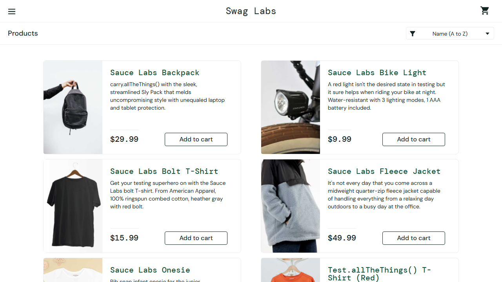

# BUG REPORT: Lỗi đồng bộ session: Tab thứ hai vẫn truy cập được trang inventory sau khi đăng xuất ở Tab đầu tiên

- **Mã Test Case:** TC42 – Đăng xuất ở một tab và thao tác trên tab khác
- **Nhóm:** Phiên đăng nhập & điều hướng
- **Mức độ nghiêm trọng:** major (Vi phạm quy chế bảo mật phiên làm việc (session management), cho phép người dùng tiếp tục thao tác trên trang được bảo vệ mặc dù đã thực hiện đăng xuất.)
- **Độ tin cậy của AI:** high

## Kết quả mong đợi
```json
{
  "outcome": "error",
  "error_contains": "You can only access",
  "post_checks": []
}
```

## Kết quả thực tế
Lẽ ra phải bị chặn ở trang đăng nhập nhưng lại vào được https://www.saucedemo.com/inventory.html

## Các bước tái hiện
1. Đăng nhập thành công và mở 2 tab (Tab 1 và Tab 2)
2. Thực hiện đăng xuất ở Tab 1
3. Chuyển sang Tab 2 và thực hiện một thao tác bất kỳ (như click thêm sản phẩm hoặc truy cập trực tiếp trang inventory.html)

## Nguyên nhân gốc rễ (Phân tích AI)
Cơ chế quản lý session phía client (LocalStorage/SessionStorage/Cookie) không được xóa hoặc đồng bộ hóa kịp thời giữa các tab trên cùng trình duyệt khi sự kiện đăng xuất xảy ra.

## Bằng chứng màn hình

