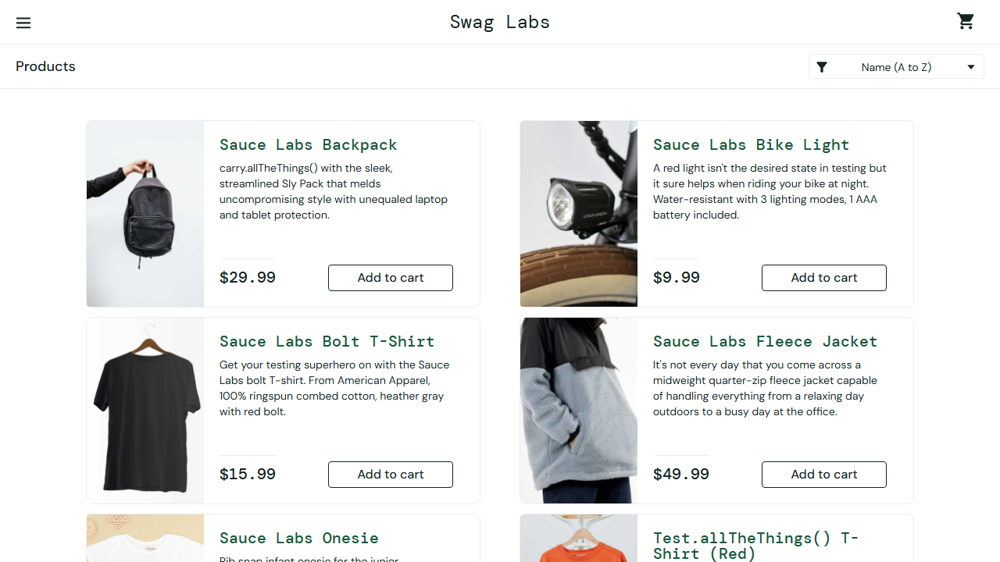

# BUG REPORT: Lỗ hổng bảo mật: Cho phép truy cập lại trang nội bộ bằng nút Back của trình duyệt sau khi đăng xuất

- **Mã Test Case:** TC_HP_43 – Sử dụng nút Back của trình duyệt để quay lại trang sản phẩm sau khi đã đăng xuất
- **Nhóm:** Phiên đăng nhập & điều hướng
- **Mức độ nghiêm trọng:** critical (Vi phạm nghiêm trọng tính bảo mật của phiên đăng nhập (Session Management), cho phép người dùng trái phép truy cập vào khu vực nội bộ sau khi đã thực hiện đăng xuất.)
- **Độ tin cậy của AI:** high

## Kết quả mong đợi
```json
{
  "outcome": "error",
  "error_contains": "Epic sadface",
  "post_checks": []
}
```

## Kết quả thực tế
Lẽ ra phải bị chặn ở trang đăng nhập nhưng lại vào được https://www.saucedemo.com/inventory.html

## Các bước tái hiện
1. Đăng nhập thành công bằng 'standard_user'
2. Thực hiện thao tác đăng xuất khỏi hệ thống (quay về trang login)
3. Bấm nút Back trên trình duyệt để quay lại trang /inventory.html

## Nguyên nhân gốc rễ (Phân tích AI)
Hệ thống không vô hiệu hóa hoàn toàn session hoặc cookie xác thực phía server khi đăng xuất, hoặc không kiểm tra trạng thái xác thực (authentication check) khi trình duyệt tải lại trang từ bộ nhớ đệm (browser cache) qua nút Back.

## Bằng chứng màn hình

